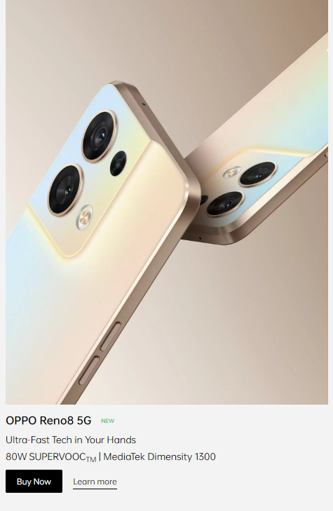

# Dom Manipulation Assignment

1. Webiste Name: [Dev To](https://dev.to/)

### Topics

    - Query Selctory, Inner HTML

### Sample Image


### Tasks

        Target the Top description div and change the DEV Community to <Your_Name> and description to your passion

### Expected Output


### Solution :

```
        document.querySelector(".side-bar .crayons-card h2").innerHTML = "Rakshit koyani";
        document.getElementsByTagName("p").innerHTML = "I Write Code";
```

### My Output


2. Website Name: [Apple](https://support.apple.com/en-in)

### Task


### Fetch all the product name and store in an array

### Expected Output

['iPhone', 'Mac', 'iPad', 'Watch', 'AirPods', 'Music', 'TV']

### Solution :

```
const arr = [];
document.querySelectorAll(".as-imagegrid-item-title").forEach((item) => {
  arr.push(item.innerText.replace("\nSupport", ""));
});
console.log(arr);
```

### My Output


3. Webiste Name: [Youtube Support](https://support.google.com/youtube/)

### Topics

    - Get Element By Id, Create Element, Create Text Node, Append Child

### Sample Image


### Tasks

     Add another FAQ 'My New FAQ' to the list

### Expected Output


### Solution :

```
let h3 = document.createElement("h3");// CREATE h3 tag
h3.innerText = "My new FAQ";
let section = document.createElement("section");      //create empty section
section.classList.add("parent");          // add 'parent' class to section
section.appendChild(h3);                //add h3 to section
document.querySelector(".accordion-homepage").appendChild(section);   //add section to accordion-homepage nav tag
```

### My Output


4. Webiste Name: [OnePlus](https://www.oneplus.in/support)

### Topics

     Query Selector, InnerText

### Sample Image


### Tasks

      Change the contact number

### Expected Output


### Solution :

```
document.querySelector(".customer-support a").innerText = "+91 6366256689";

```

### My Output


5. Webiste Name: [Samsung](https://www.samsung.com/in/offer/online/samsung-fest/)

### Topics

       getElementById, createElement, InnerText, append, setAttribute

### Sample Image


### Tasks

     Target the main div of card and change the Button text to Check out

### Expected Output


### Solution :

```
document.querySelector(".diwali-deals-product-sale-btn").innerText = "Check out";


```

### My Output


6. Webiste Name: [Adidas](https://www.adidas.co.in/)

### Topics

    -   Query Selector, Event listeners, Changing Styles

### Sample Image


### Tasks

     Target the search box and on hover change thebackground color to red.

### Expected Output


### Solution :

```
document.querySelector(".searchinput___zXLAR").addEventListener("mouseover", bgChange );
function bgChange() {
  document.querySelector(".searchinput___zXLAR").style.background = "red";
}
document.querySelector(".searchinput___zXLAR").addEventListener("mouseout", bgChange2 );
function bgChange2() {
  document.querySelector(".searchinput___zXLAR").style.background = "transparent";
}
```

### My Output


7. Webiste Name: [MDN Web Docs](https://developer.mozilla.org/en-US/)

### Topics

       Form, Value, Submit

### Sample Image


### Tasks

     To Search a topic in the MDN Search bar.
     First add a text to search in the search bar and then hit the submit search button to search the docs using DOM

### Expected Output


### Solution :

```
function search(Text) {
  let input = document.querySelector("#top-nav-search-input");
  input.value = Text;
  let form = document.querySelector("#top-nav-search-form");
  form.submit();
}
search("css");
```

### My Output


8. Webiste Name: [Google](https://www.google.com/)

### Topics

       Remove Elements

### Sample Image


### Tasks

     Remove alternate languages from the home page languages listed

### Expected Output


### Solution :

```
let lang = document.querySelectorAll("#SIvCob a");
function remove(lang) {
for (let i = 0; i < lang.length; i+=2) {
    lang[i].remove();
}
}
remove(lang);
```

### My Output


9. Webiste Name: [Code Wars](https://www.codewars.com/)

### Topics

       Change Font Family, Color of Text.

### Sample Image


### Tasks

    Change the font family of the text to monospace and text color to the logo’s background color.

### Expected Output


### Solution :

```
const text = document.querySelector(".display-heading-1");
text.style.color = "#b1361e";
text.style.fontFamily = "monospace";
```

### My Output


10. Webiste Name: [Freecodecamp](https://www.freecodecamp.org/)

### Topics

       querySelector, mouseover, click eventListener,  callback function, style,

### Sample Image


### Tasks

    Target the button and change background colour on mouseover

### Expected Output


### Solution :

```
  const btn = document.querySelector(".btn-cta-big ")
  const btnText = document.querySelector(".btn-cta-big .login-btn-text")

  //mouseover
  btn.addEventListener("mouseover", function() {
    btnText.style.background = "red";
  });
  btn.addEventListener("mouseout", function() {
    btnText.style.background = "transparent";
  });
```

### My Output


11. Webiste Name: [realme](https://www.realme.com/in/)

### Topics

       querySelector,style,background-image

### Sample Image


### Tasks

    change the realme logo to ineuron logo

### Expected Output


### Solution :

```
const logo = document.querySelector('.wrapper .logo .icon  ');
  logo.style.backgroundImage = "url(https://ineuron.ai/images/ineuron-logo.png)";
```

### My Output


12. Webiste Name: [Github](https://github.com/)

### Topics

       querySelector,style,background-Color

### Sample Image


### Tasks

     change the background colour of the button to blue.

### Expected Output


### Solution :

```
document.querySelector(".js-repos-container h2 a").style.background = "blue";

```

### My Output


13. Webiste Name: [Hackerrank](https://www.hackerrank.com/)

### Topics

       querySelector,innerHtml

### Sample Image


### Tasks

Target the top description and change “Matching developers with great companies” to ‘JSBOOTCAMP“.

### Expected Output


### Solution :

```
const desc = document.querySelector(".fl-heading .fl-heading-text");
desc.innerHTML = "JSBOOTCAMP"
desc.style.fontSize = "2rem";
```

### My Output


14. Webiste Name: [Asus](https://www.asus.com/in/)

### Topics

      querySelector,style,font-size

### Sample Image


### Tasks

       change the fontsize of “Hot Deals” to 80px

### Expected Output


### Solution :

```
const desc = document.querySelector(".HotDealsAll__Heading__2fIbe");
desc.style.fontSize = "80px";
```

### My Output


15. Webiste Name: [Dell](https://www.dell.com/en-in/shop/deals/laptop-deals?gacd=10415953-9016-5761040-285981356-0&dgc=ST&gclid=Cj0KCQjwguGYBhDRARIsAHgRm4-XUDMhhVNyHXb3s1gY4ZBzORr_d9Se-buhJwy7asyUe7YdqEA11eEaAt6UEALw_wcB&gclsrc=aw.ds&nclid=BxjBlpBQsX6pjSHh-L8YYSU77EpfXRkG1AGMB5Wbeu386ykspfrPDnfx_DdFau20)

### Topics

      querySelector,style.textAlign

### Sample Image


### Tasks

       Convert the text “G15 Gaming Laptop” from left to right

### Expected Output


### Solution :

```
const desc = document.querySelector(".ps-title ").
desc.style.textAlign = "right";
```

### My Output


16. Webiste Name: [Vercel](https://vercel.com/)

### Topics

     querySelector,innerHTMl

### Sample Image


### Tasks

      change the heading “Start with the developer” to “Start with Scratch”

### Expected Output


### Solution :

```
document.querySelector(".section-title_title__VEDfK").innerHTML = "Start with Scratch";
```

### My Output


17. Webiste Name: [Sony](https://www.sony.co.in/)

### Topics

    querySelector,innerHTMl

### Sample Image


### Tasks

     change the button text To current Date.

### Expected Output


### Solution :

```
  var btn = document.querySelector(".btn-container");
  const d = new Date();
  btn.innerHTML = d;
```

### My Output


18. Webiste Name: [Philips](https://www.philips.co.in/)

### Topics

     querySelector,style,backgroundcolor

### Sample Image


### Tasks

    change the background colour blue to orange

### Expected Output


### Solution :

```
document.querySelector(".p-footer").style.background  = "orange";
```

### My Output


19. Webiste Name: [Canon](https://in.canon/)

### Topics

          querySelector,src

### Sample Image


### Tasks

    extract the canon logo

### Expected Output


### Solution :

```
let logoExtract = document.querySelector(".navbar-brand .logo").src;
document.querySelector(".navbar-brand").innerText = logoExtract;

```

### My Output


20. Webiste Name: [Oppo](https://www.oppo.com/in/)

### Topics

          querySelector,style,color

### Sample Image



### Tasks

      Change the description colour black to orange

### Expected Output


### Solution :

```
const specs = document.querySelector(".desc");
specs.style.color = "orange";
```

### My Output


